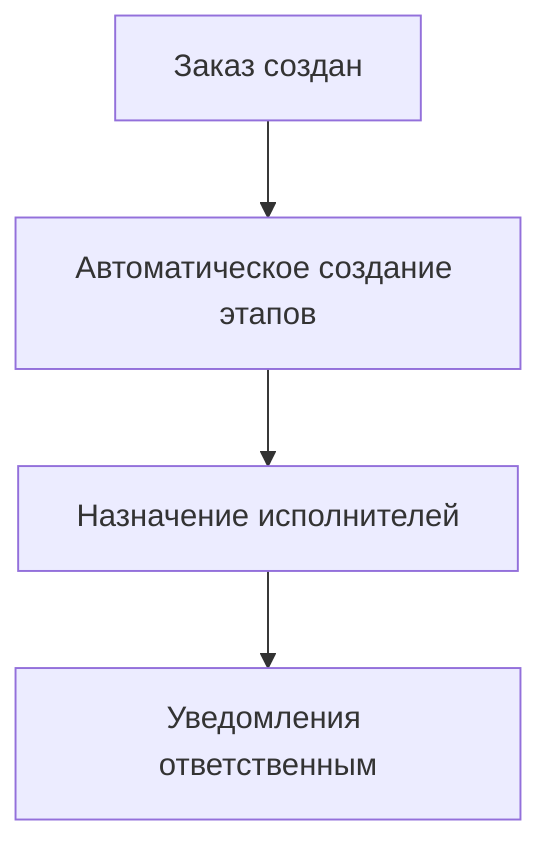
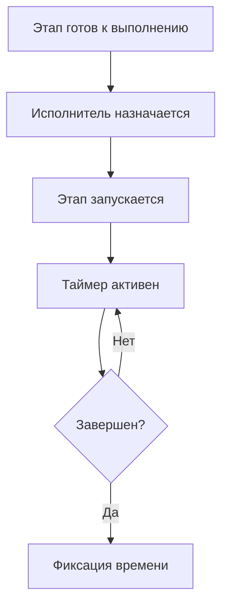
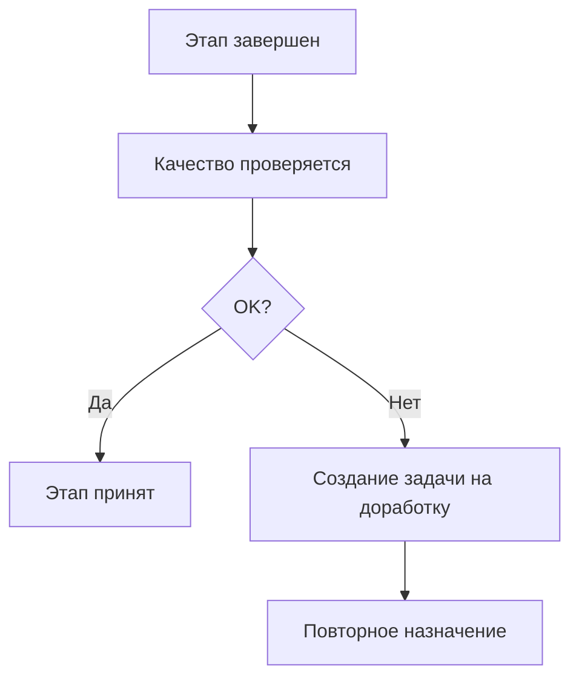

# Управление этапами производства (ProductionSteps)

## Обзор
Страница управления этапами производства предоставляет централизованный интерфейс для отслеживания и управления производственными процессами заказов в реальном времени.

## Функциональность

### 📊 Централизованное управление production
- **Объединенный вид** всех этапов производства по всем заказам
- **Real-time обновления** статуса этапов без перезагрузки
- **Фильтрация и поиск** по заказам, статусам, исполнителям
- **Drag & Drop** для переназначения этапов между исполнителями
- **Bulk операции** для массовых обновлений

### 📈 Производственный дашборд
- **Общая статистика** - выполненные/активные/просроченные этапы
- **Производительность по исполнителям** - timeline и метрики
- **Загрузка производства** - capacity planning и bottlenecks
- **Прогноз завершения** - estimated completion times
- **Quality metrics** - defect rates и rework statistics

### 🔄 Управление этапами
- **Запуск этапа** - начало выполнения с таймером
- **Завершение этапа** - с указанием затраченного времени и качества
- **Переназначение** - изменение ответственного исполнителя
- **Приостановка** - временная остановка с причиной
- **Откат этапа** - возвращение на предыдущую стадию

### ⚠️ Уведомления и алерты
- **Просроченные этапы** - automatic alerts и escalation
- **Bottlenecks** - выявление узких мест в производстве
- **Quality issues** - дефекты и необходимость доработки
- **Resource conflicts** - конфликты ресурсов и capacity overload

## API Endpoints

```typescript
GET    /production/steps/           // Список всех этапов
PATCH  /production/steps/{id}/start // Запуск этапа
PATCH  /production/steps/{id}/complete // Завершение этапа
PATCH  /production/steps/{id}/assign // Переназначение исполнителя
GET    /production/dashboard        // Статистика производства
GET    /production/overdue          // Просроченные этапы
POST   /production/bulk-update      // Массовые операции
```

## Архитектура данных

### Этап производства
```typescript
interface ProductionStep {
  id: number;
  order_id: number;
  name: string;                    // Название этапа
  description?: string;
  sequence_number: number;         // Порядок выполнения
  status: ProductionStatus;        // pending, in_progress, completed, paused
  estimated_hours: number;
  actual_hours?: number;
  started_at?: Date;
  completed_at?: Date;
  assigned_to?: number;           // User ID
  assigned_user?: User;
  notes?: string;
  quality_rating?: number;        // 1-5 quality assessment
  issues_reported?: string[];     // Массив проблем
}
```

### Статусы этапов
```typescript
enum ProductionStatus {
  PENDING = 'pending',         // Ожидает выполнения
  IN_PROGRESS = 'in_progress',  // В работе
  COMPLETED = 'completed',     // Завершен
  PAUSED = 'paused',           // Приостановлен
  BLOCKED = 'blocked',         // Заблокирован
  CANCELLED = 'cancelled'      // Отменен
}
```

### Метрики производства
```typescript
interface ProductionMetrics {
  total_steps: number;
  completed_steps: number;
  in_progress_steps: number;
  overdue_steps: number;
  average_completion_time: number;
  efficiency_rate: number;        // Процент успешного выполнения
  quality_score: number;          // Средний рейтинг качества
}
```

## Workflow управления

### 1. Создание заказа


### 2. Выполнение этапа


### 3. Контроль качества


## Интеграция с системами

### 👥 Пользователи (Users)
```typescript
// Связи с исполнителями
production_step.assigned_to → user.id
production_step.assigned_user → user.profile
```

### 📦 Заказы (Orders)
```typescript
// Этапы принадлежат заказам
production_step.order_id → order.id
order.production_steps[] → production_steps
```

### ✅ Задачи (Tasks)
```typescript
// Автоматическое создание задач
production_step.delayed → task.create()
production_step.quality_issue → task.create()
```

### 🤖 Автоматизация (Automation)
```typescript
// Триггеры на события этапов
production_step.started → automation.trigger('step_started')
production_step.completed → automation.trigger('step_completed')
production_step.overdue → automation.trigger('step_overdue')
```

## UX/UI особенности

- **Kanban board** для визуального управления этапами
- **Timeline view** для отслеживания прогресса
- **Gantt chart** для планирования ресурсов
- **Mobile responsive** для работы на планшетах
- **Voice commands** для быстрого обновления статуса

## Производительность

- **Virtualized lists** для больших объемов данных
- **WebSocket updates** для real-time синхронизации
- **Background sync** для offline работы
- **Progressive loading** этапов по мере прокрутки

## Безопасность

- **Role-based access** - менеджеры vs исполнители
- **Audit logging** всех изменений этапов
- **Data validation** перед сохранением
- **Backup & recovery** производственных данных

## Мониторинг и аналитика

### 📊 KPI производства
- **On-time delivery** - процент своевременных поставок
- **First pass yield** - процент бездефектного выполнения
- **Cycle time** - среднее время выполнения этапа
- **Resource utilization** - эффективность использования ресурсов

### 🚨 Алгоритмы предиктивной аналитики
- **Прогноз просрочек** на основе исторических данных
- **Рекомендации по оптимизации** процессов
- **Предиктивное обслуживание** оборудования
- **Demand forecasting** для планирования ресурсов

## Разработка и интеграция

### 🔧 Технические требования
- **Real-time updates** через WebSocket/SSE
- **Offline-first** для производственных сред
- **Progressive Web App** для мобильных устройств
- **API-first** архитектура для интеграций

### 🧪 Тестирование
- **Unit tests** бизнес-логики
- **Integration tests** workflow
- **Load tests** для высокой нагрузки
- **E2E tests** полных сценариев

### 📚 Документация
- **API documentation** OpenAPI/Swagger
- **Process documentation** с диаграммами
- **Training materials** для исполнителей
- **Troubleshooting guides**

## Будущие улучшения

### 🤖 AI-powered features
- **Automatic quality inspection** через computer vision
- **Predictive maintenance** для оборудования
- **Smart scheduling** на основе ML моделей
- **Voice-controlled production** через speech recognition

### 📊 Advanced analytics
- **Real-time dashboards** с custom KPIs
- **Production simulation** для what-if анализа
- **Supply chain optimization** через ML
- **Sustainability metrics** и отчетность

### 🔗 IoT интеграция
- **Smart sensors** для отслеживания прогресса
- **Automated workflows** через IoT triggers
- **Energy monitoring** и оптимизация
